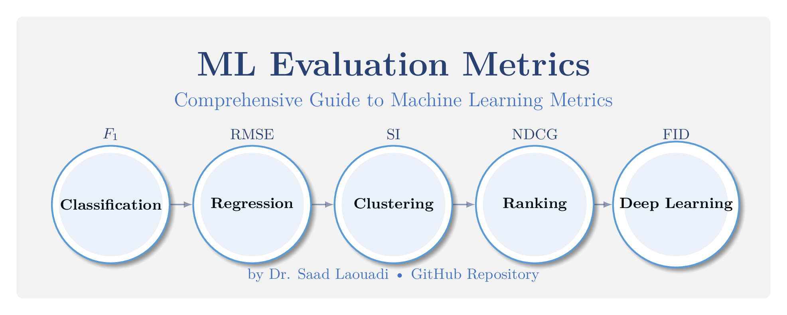

# Machine Learning Evaluation Metrics Guide

<div align="center">



[](https://github.com/laouadi/ml-evaluation-metrics/stargazers)
[](https://github.com/laouadi/ml-evaluation-metrics/blob/main/LICENSE)
[](https://github.com/laouadi/ml-evaluation-metrics/issues)
[](https://github.com/laouadi/ml-evaluation-metrics/pulls)

</div>

## 📚 Overview

A comprehensive guide to evaluation metrics in machine learning, covering everything from basic classification metrics to advanced deep learning evaluation techniques. This repository serves as both a theoretical reference and practical implementation guide for ML practitioners, researchers, and students.

## 🎯 Categories

### 1. Classification Metrics
- F1 Score, Precision, Recall
- Cohen's Kappa
- Matthews Correlation Coefficient (MCC)
- Balanced Accuracy
- Specificity and Sensitivity
- DOR (Diagnostic Odds Ratio)

### 2. Regression Metrics
- RMSE (Root Mean Square Error)
- MAE (Mean Absolute Error)
- MAPE (Mean Absolute Percentage Error)
- R-squared and Adjusted R-squared
- SMAPE (Symmetric Mean Absolute Percentage Error)
- Huber Loss

### 3. Ranking Metrics
- NDCG (Normalized Discounted Cumulative Gain)
- MAP (Mean Average Precision)
- MRR (Mean Reciprocal Rank)
- AUC-PR (Area Under Precision-Recall Curve)

### 4. Clustering Metrics
- Silhouette Score
- Davies-Bouldin Index
- Calinski-Harabasz Index
- Dunn Index
- Rand Index
- Mutual Information Based Scores

### 5. Distance Metrics
- Euclidean Distance
- Manhattan Distance
- Cosine Similarity
- Jaccard Similarity
- Hamming Distance
- Mahalanobis Distance

### 6. Information Theory Metrics
- Cross-Entropy
- KL Divergence
- Mutual Information
- Information Gain
- Entropy Measures

### 7. Deep Learning Specific Metrics
- Inception Score
- FID (Fréchet Inception Distance)
- BLEU Score (for NLP)
- ROUGE Score (for text summarization)
- METEOR Score
- Perplexity

## 📋 Prerequisites

- Python 3.8+
- NumPy
- Pandas
- Scikit-learn
- TensorFlow/PyTorch (for deep learning metrics)
- Matplotlib/Seaborn (for visualizations)

## 🚀 Installation

### Using Poetry (recommended)
```bash
# Clone the repository
git clone https://github.com/dr-saad-la/ml-evaluation-metrics.git
cd ml-evaluation-metrics

# Install with Poetry
poetry install
```

### Using Pip

```bash
git clone https://github.com/dr-saad-laouadi/ml-evaluation-metrics.git
cd ml-evaluation-metrics
pip install -r requirements.txt
```


## 📖 Documentation Structure

Each metric in this repository is thoroughly documented with:

- 📐 **Mathematical Formulation**
  - Detailed mathematical definitions
  - Variable explanations
  - Formula derivations when relevant

- 💡 **Implementation Details**
  - Step-by-step implementation guide
  - Best practices and optimization tips
  - Common pitfalls and solutions

- 🎯 **Use Cases and Examples**
  - Real-world applications
  - Industry-specific scenarios
  - Practical implementation examples

- ⚖️ **Advantages and Limitations**
  - Strengths and weaknesses
  - Performance considerations
  - Comparison with similar metrics

- 📊 **Visual Explanations**
  - Intuitive diagrams and plots
  - Performance visualizations
  - Comparative analysis charts

- 💻 **Code Examples**
  - Ready-to-use implementations
  - Unit tests
  - Performance benchmarks

## 💻 Usage Examples

```python
# Import necessary metrics
from ml_metrics.classification import f1_score
from ml_metrics.regression import rmse
from ml_metrics.clustering import silhouette

# Classification metric example
y_true = [1, 0, 1, 1, 0]
y_pred = [1, 0, 0, 1, 0]
f1 = f1_score(y_true, y_pred)

# Regression metric example
y_true = [3.2, 4.5, 5.0, 1.2]
y_pred = [3.1, 4.3, 5.2, 1.1]
error = rmse(y_true, y_pred)

# Clustering metric example
labels = [0, 0, 1, 1]
features = [[1,2], [2,2], [8,9], [9,9]]
score = silhouette(features, labels)
```

## 🤝 Contributing

We warmly welcome contributions from the community! Here's how you can help:

1. Fork the Project
2. Create your Feature Branch (`git checkout -b feature/AmazingFeature`)
3. Commit your Changes (`git commit -m 'Add some AmazingFeature'`)
4. Push to the Branch (`git push origin feature/AmazingFeature`)
5. Open a Pull Request

Please ensure you read our [Contributing Guidelines](CONTRIBUTING.md) and [Code of Conduct](CODE_OF_CONDUCT.md) before making a contribution.

## 📜 License

This project is licensed under the Apache License 2.0 - see the [LICENSE](LICENSE) file for details.

## 👤 Author

**Dr. Saad Laouadi**

- 🌐 Website: [quantcodingversity.com](https://quantcodingversity.com)
- 💼 LinkedIn: [@saadlaouadi](https://linkedin.com/in/saadlaouadi)
- 🐦 Twitter: [@saadlaouadi](https://twitter.com/saadlaouadi)

## ⭐ Show your support

If you find this project helpful, please consider giving it a star! ⭐️

## 📝 Citation

If you use this work in your research, please cite:

```bibtex
@misc{laouadi2024mlmetrics,
    author = {Laouadi, Saad},
    title = {Machine Learning Evaluation Metrics},
    year = {2025},
    publisher = {GitHub},
    journal = {GitHub repository},
    howpublished = {\url{https://github.com/dr-saad-la/ml-evaluation-metrics}}
}
```

## 🙏 Acknowledgments

TO-DO

<div align="center">
    Made with ❤️ by Dr. Saad Laouadi
</div>


